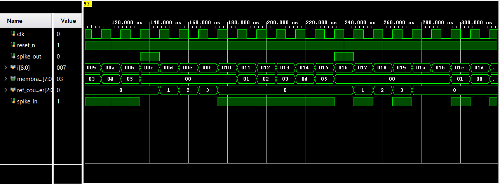
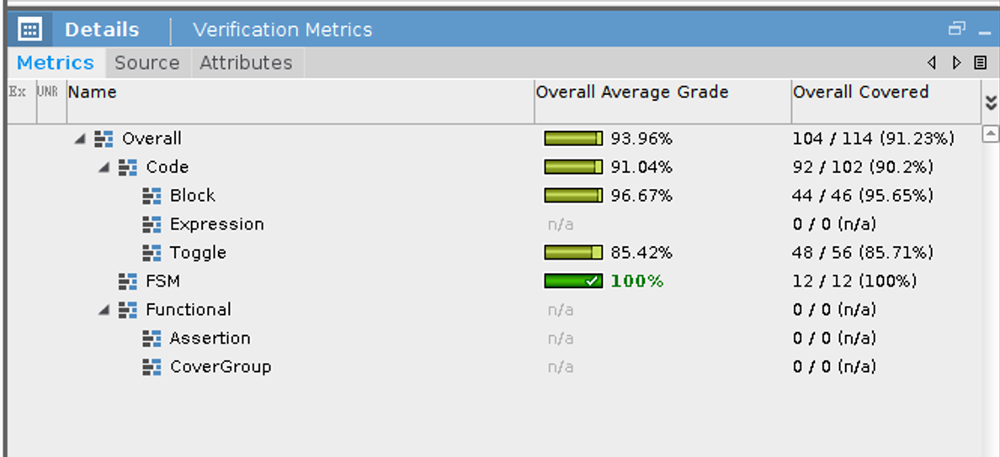
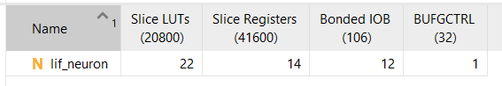
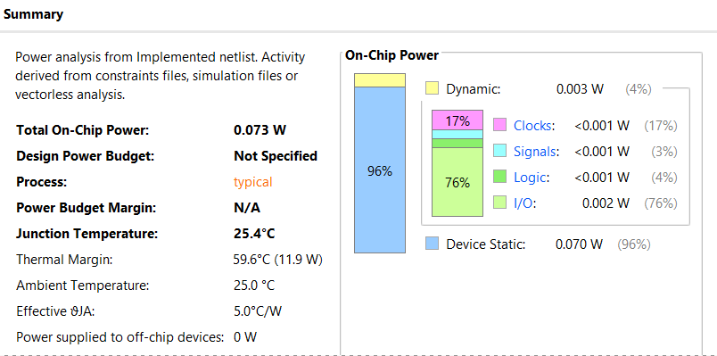

# FPGA-Based-Digital-LIF-Neuron
Digital implementation of a Leaky Integrate-and-Fire (LIF) neuron using Verilog. It integrates input spikes, applies membrane leakage, generates threshold-based spikes, and includes a refractory period. Its event-driven and hardware-efficient design supports low-power neuromorphic computing and spiking neural network applications.

# Digital Leaky Integrate-and-Fire (LIF) Neuron in Verilog

## Overview

This project presents a digital implementation of a Leaky Integrate-and-Fire (LIF) neuron using Verilog HDL. The LIF neuron is a fundamental building block in neuromorphic computing and Spiking Neural Networks (SNNs).

The neuron receives input spike events and accumulates them in a membrane potential register. When no input spike is present, the membrane potential gradually decreases due to leakage. Once the membrane potential reaches a predefined threshold, the neuron generates an output spike. After firing, the neuron enters a refractory period before returning to normal operation.

## Features

- Digital implementation using Verilog HDL
- Input spike integration
- Membrane potential accumulation
- Configurable synaptic weight
- Membrane leakage
- Threshold-based spike generation
- Refractory period implementation
- Finite State Machine (FSM)-based operation
- RTL simulation and verification
- FPGA resource utilization analysis
- Power estimation
- Functional coverage analysis

## Architecture

The LIF neuron operates using three main states:

### 1. IDLE State

The neuron receives and integrates incoming spike events. The membrane potential increases when an input spike is received. If no spike is present, the membrane potential decreases according to the leakage value.

### 2. SPIKE State

When the membrane potential reaches or exceeds the threshold value, the neuron generates an output spike and resets the membrane potential.

### 3. REFRACTORY State

After generating an output spike, the neuron enters a refractory period. During this time, incoming spikes are temporarily ignored. A refractory counter controls the duration of this state.

## Working Principle
```text 
Input Spike
     │
     ▼
Membrane Integration
     │
     ├── No Input → Membrane Leakage
     │
     ▼
Threshold Check
     │
     ├── Threshold Not Reached → Continue Integration
     │
     └── Threshold Reached
              │
              ▼
        Generate Output Spike
              │
              ▼
       Refractory Period
              │
              ▼
            IDLE

```
## Results and Analysis

### 1. Simulation Results

The simulation waveform verifies the correct operation of the digital LIF neuron. Input spikes are integrated into the membrane potential, while the leakage mechanism reduces the membrane potential when no input spike is present.

When the membrane potential reaches the predefined threshold, the neuron generates an output spike. After firing, the membrane potential is reset and the neuron enters the refractory state for the configured number of clock cycles before returning to normal operation.

The waveform verifies:

- Input spike integration
- Membrane potential accumulation
- Membrane leakage
- Threshold-based spike generation
- Membrane reset after firing
- Refractory period operation



---

### 2. Verification Coverage

The RTL design was verified using simulation coverage analysis.

The overall coverage achieved was **91.23%**, with complete FSM coverage of **100%**.

| Coverage Metric | Result |
|---|---:|
| Overall Coverage | 91.23% |
| Code Coverage | 90.20% |
| Block Coverage | 95.65% |
| Toggle Coverage | 85.71% |
| FSM Coverage | 100% |

The high block and FSM coverage indicates that the major design logic and all FSM transitions were successfully exercised during simulation. The remaining uncovered portions are mainly related to toggle coverage.



---

### 3. FPGA Resource Utilization

The design was synthesized and analyzed using Xilinx Vivado.

The digital LIF neuron requires only a small number of FPGA resources, demonstrating its lightweight hardware implementation.

| FPGA Resource | Utilization |
|---|---:|
| Slice LUTs | 22 |
| Slice Registers | 14 |
| Bonded I/O | 12 |
| BUFGCTRL | 1 |

The low LUT and register utilization shows that the proposed LIF neuron can be efficiently scaled for larger neuromorphic architectures.



---

### 4. Power Analysis

Power analysis was performed using the Vivado implemented design.

The estimated total on-chip power consumption was **0.073 W**.

| Power Component | Power |
|---|---:|
| Total On-Chip Power | 0.073 W |
| Device Static Power | 0.070 W |
| Dynamic Power | 0.003 W |
| I/O Power | 0.002 W |

The low dynamic power consumption of **0.003 W** demonstrates the hardware efficiency of the digital LIF neuron. Since the architecture is event-driven, computation and switching activity occur primarily in response to input spike events, making the design suitable for low-power neuromorphic computing applications.



---

## Results Summary

The digital LIF neuron was successfully designed, simulated, verified, and analyzed.

- RTL functionality successfully verified through simulation.
- Overall verification coverage of **91.23%** achieved.
- **100% FSM coverage** achieved.
- Low hardware utilization with only **22 LUTs** and **14 registers**.
- Estimated total on-chip power consumption of **0.073 W**.
- Dynamic power consumption limited to **0.003 W**.

These results demonstrate that the proposed digital LIF neuron provides a lightweight and hardware-efficient building block for future neuromorphic computing and Spiking Neural Network architectures.
